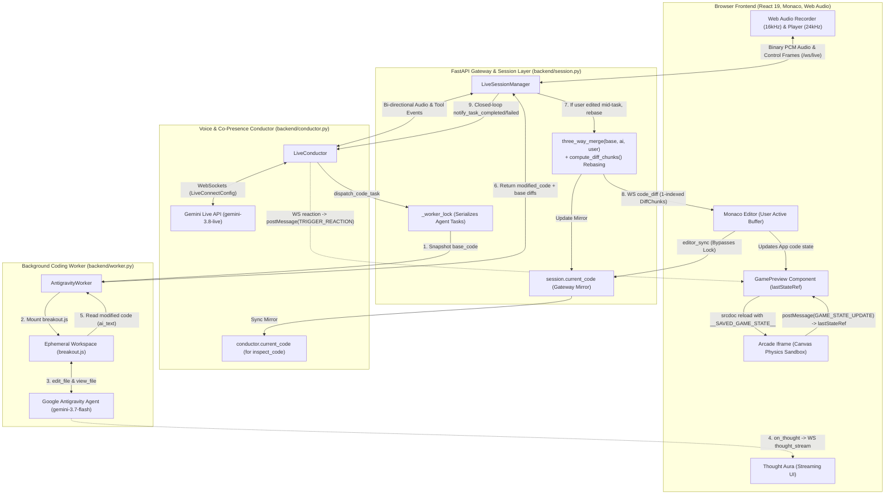

# Gemini: Player 2 — Backend Architecture & Engineering Guide

> **Proof of Concept**: Technical architecture and engineering guide demonstrating how to bridge the **Gemini Multimodal Live API** (`google-genai`) and the **Google Antigravity SDK** (`google-antigravity`).

This document outlines the architecture, concurrency design, real-time protocols, and modular separation of concerns implemented across the **Gemini: Player 2** backend.

---

## 1. Architectural Thesis: Linking Gemini Live API & Google Antigravity SDK

The defining architectural thesis of **Gemini: Player 2** is solving the fundamental tradeoff in real-time AI agents: **low-latency voice co-presence vs. deep autonomous code generation**.

### The Engineering Tradeoff
* **The Voice Bottleneck**: Real-time conversational models like `gemini-3.8-live` are built for ultra-fast, turn-by-turn conversational audio. They must process 16kHz linear PCM frames, evaluate voice activity detection (VAD), and emit 24kHz synthesized audio parts in under 500 milliseconds. If you force a streaming voice model to emit a massive 500-line code refactor, the voice connection locks up, audio buffers stall, and the illusion of sitting next to a living human co-pilot is shattered.
* **The Coding Agent Tradeoff**: Autonomous coding agent frameworks like the **Google Antigravity SDK** (`google-antigravity`) excel at multi-step reasoning, workspace inspection, policy hooks, thought streaming (`response.thoughts`), and surgical line diff generation using high-horsepower reasoning models like `gemini-3.7-flash`. However, coding agents operate asynchronously and possess no native audio pipeline, full-duplex WebSocket framing, or barge-in mechanics.

**Gemini: Player 2 solves this by building an asynchronous orchestration bridge that links both SDKs into a single, unified pair programmer:**



### How the Two SDKs Cooperate

#### 1. Front-of-House: Gemini Multimodal Live API (`google-genai`)
- **Connection**: Managed in [`LiveConductor`](backend/conductor.py#L33) via `client.aio.live.connect(model="gemini-3.8-live", config=...)`.
- **Audio Pipeline**: Streams raw 16kHz 16-bit linear PCM microphone audio from the browser directly to Gemini Live using `types.Blob(data=pcm_16k_data, mime_type="audio/pcm;rate=16000")`. Receives 24kHz synthesized PCM audio back and streams binary frames to the browser's Web Audio graph.
- **Native Turn-Taking & Interruption**: Detects user speech mid-sentence via upstream VAD, immediately emitting `InterruptedEvent` to flush client audio buffers and halt model playback.
- **Synchronous Tool Calling**: The Live Conductor exposes four synchronous tools to `gemini-3.8-live`:
  - `move_cursor(line, col, gesture)`: Moves Player 2's glowing caret in Monaco.
  - `inspect_code(start_line, end_line)`: Inspects slices of the user's active editor buffer.
  - `react_emotion(mood, effect)`: Triggers screen reactions and emote states.
  - `dispatch_code_task(instruction, context_snippet)`: **The Bridge.** Instead of generating code itself, the Live model invokes this tool with a high-level instruction and immediately keeps conversing.

##### 2. Back-of-House: Google Antigravity SDK (`google-antigravity`)
- **Worker Execution**: Managed in [`AntigravityWorker`](backend/worker.py#L147). Configured with `gemini-3.7-flash` (the default model of the Antigravity SDK) via `google.antigravity.Agent` and `LocalAgentConfig` with workspace isolation and native `BuiltinTools.VIEW_FILE` / `BuiltinTools.EDIT_FILE`.
- **Thought Streaming (`response.thoughts`)**: As the Antigravity worker reasons about game physics, collisions, or graphics, raw thought tokens are intercepted in real time and pushed over the WebSocket as `ThoughtStreamEvent` payloads, illuminating the UI's ambient **Thought Aura**.
- **Native Workspace File Operations**: Code is written to `breakout.js` in an isolated temporary workspace directory. The agent interacts with the codebase through native file tools (`view_file`, `edit_file`) rather than prompt-based line number arithmetic.
- **Deterministic Diff Output**: Changes to `breakout.js` are converted into mathematical `DiffChunk` objects (`start_line`, `end_line`, `new_text`) via `compute_diff_chunks(old_code, new_code)` using `difflib.SequenceMatcher`, which are applied to Monaco via `executeEdits` without resetting user caret or undo stacks.

#### 3. The Closed-Loop Telemetry & Honest Error Bridge
- Once the Antigravity worker finishes, one of two flows occurs:
  1. **Success Flow**:
     - [`LiveSessionManager`](backend/session.py#L140) updates its code mirror and invokes `conductor.update_code(self.current_code)`. Subsequent calls to `inspect_code()` read the freshly patched JavaScript.
     - [`LiveConductor.notify_task_completed`](backend/conductor.py#L188) whispers an environmental update directly into the Live session stream using `session.send_realtime_input(text=...)`:
       ```text
       [Environment update: Antigravity worker finished applying code changes on line(s) [105]: Change the ball color and its trailing glow to vibrant gold (#fbbf24).]
       ```
     - The Live model consumes this event mid-conversation, reacts naturally, and talks enthusiastically about the newly added gameplay mechanics.
  2. **Failure Flow**:
     - If the agent makes no changes or throws an error, `session.py` calls [`LiveConductor.notify_task_failed`](backend/conductor.py#L209).
     - The Conductor whispers an honest environmental failure event to `gemini-3.8-live`:
       ```text
       [Environment update: Antigravity worker FAILED to apply code changes for "Double ball speed". Reason: syntax error... Speak to the user honestly: tell them you couldn't make that edit, explain what went wrong, and sound authentic—do not claim success.]
       ```
     - The voice model speaks candidly and explains what happened, preventing false success hallucinations.

---

## 2. Directory Structure & Separation of Concerns (SoC)

The backend strictly maintains single-responsibility boundaries:

```
backend/
├── __init__.py          # Package root
├── constants.py         # Static configuration, system prompts, starter Breakout game code
├── models.py            # Strongly-typed Pydantic V2 event contracts and schemas
├── conductor.py         # Gemini Live API client, audio I/O streaming, tool definitions
├── worker.py            # Antigravity/Flash code diff generation and thought streaming
├── session.py           # Client WebSocket lifecycle, concurrency locks, code mirror
└── main.py              # Minimal FastAPI application, routes, static asset mounts
```

### Module Responsibilities

| Module | Primary Responsibility | Key Classes / Functions |
|---|---|---|
| [`main.py`](backend/main.py) | App configuration, CORS, REST endpoints (`/api/health`, `/api/starter-code`), static mounts, `/ws/live` delegate. | `app`, `health_check()`, `starter_code()`, `live_websocket_endpoint()` |
| [`session.py`](backend/session.py) | Client WebSocket connection manager, message deserialization, task serialization, code mirror sync. | [`LiveSessionManager`](backend/session.py#L55), [`apply_code_edits()`](backend/session.py#L34), [`handle_live_session()`](backend/session.py#L357) |
| [`conductor.py`](backend/conductor.py) | Native Gemini Live WebSocket management (`client.aio.live.connect`), audio streaming, tool calls, multi-turn loop. | [`LiveConductor`](backend/conductor.py#L33), `_build_tools()`, [`listen_loop()`](backend/conductor.py#L269) |
| [`worker.py`](backend/worker.py) | Antigravity background worker, workspace sandbox management, thought streaming, deterministic diff generation. | [`AntigravityWorker`](backend/worker.py#L147), `execute_task()`, [`compute_diff_chunks()`](backend/worker.py#L17) |
| [`models.py`](backend/models.py) | Pydantic event schemas for all bidirectional WebSocket traffic. | `DiffChunk`, `CodeDiffEvent`, `ThoughtStreamEvent`, `CursorMoveEvent`, `EmotionEvent`, `StatusEvent`, `PingEvent`, `PongEvent` |
| [`constants.py`](backend/constants.py) | Fixed configurations: `DEFAULT_BREAKOUT_CODE`, system instructions, default voice (`Puck`), default models. | `DEFAULT_BREAKOUT_CODE`, `CONDUCTOR_SYSTEM_INSTRUCTION` |

---

## 3. Core Pipelines & Engineering Protocols

### A. Full-Duplex Audio & Speech Pipeline

```
[User Mic] -> 16kHz PCM -> Client WS -> session.handle_client_message
                                                     │
                                                     ▼
                                      conductor.send_audio_chunk
                                                     │
                                                     ▼
                                       google-genai Live API
                                                     │
                                                     ▼
                                      conductor.listen_loop (24kHz PCM)
                                                     │
                                                     ▼
                                            session.on_audio_out
                                                     │
                                                     ▼
[Browser AudioPlayer] <- 24kHz PCM <- Client WS Binary Frame
```

1. **Microphone Audio Ingestion**:
   - The frontend records 16-bit linear PCM at 16,000 Hz.
   - Binary WebSocket frames are forwarded directly to [`LiveConductor.send_audio_chunk`](backend/conductor.py#L229).
   - Audio is sent upstream wrapped as a `types.Blob(data=..., mime_type="audio/pcm;rate=16000")`.

2. **Model Audio Playback**:
   - The upstream Gemini Live API returns 24,000 Hz PCM audio parts inside `server_content.model_turn.parts`.
   - Chunks are extracted and forwarded over the WebSocket as raw binary frames to the client for zero-latency playback in `AudioPlayer`.

3. **Barge-In Handling**:
   - When the upstream API detects user speech while the model is responding, it emits `server_content.interrupted = True`.
   - The backend immediately dispatches an [`InterruptedEvent`](backend/models.py#L69) (`{"type": "interrupted"}`) down to the client.
   - The client cancels all scheduled Web Audio buffer nodes, resets the playhead, and silences playback immediately.

4. **Multi-Turn Continuity**:
   - `session.receive()` terminates each time a conversational turn completes (`turn_complete=True`).
   - [`LiveConductor.listen_loop`](backend/conductor.py#L248) wraps `session.receive()` in an inner `while self.is_running and self.session:` loop.
   - When a turn completes or a tool response is returned, the loop immediately invokes `session.receive()` again without destroying the active session context.

---

### B. Surgical Code Modification & 3-Way Merge Concurrency

To prevent race conditions when the user edits code in Monaco while an Antigravity worker task is in-flight, the backend uses a strictly synchronized 3-way merge workflow:

```
Conductor Tool Call (dispatch_code_task)
              │
              ▼
session.on_dispatch_task(instruction)
              │
              ▼ (Async Task Spawned)
     async with self._worker_lock:
              │
              ├─► 1. Emit StatusEvent ("coding")
              │
              ├─► 2. Snapshot base_code = self.current_code
              │
              ├─► 3. worker.execute_task()
              │        ├── Mount isolated workspace with breakout.js
              │        ├── Agent modifies breakout.js via edit_file / view_file
              │        ├── Stream reasoning thoughts -> ThoughtStreamEvent
              │        └── compute_diff_chunks() produces Monaco DiffChunk objects
              │
              ├─► 4. Check for Concurrent User Edits:
              │        ├── If self.current_code == snapshot_code:
              │        │     Apply diffs directly to buffer
              │        └── If self.current_code != snapshot_code:
              │              ├── three_way_merge(base, ai, user)
              │              └── compute_diff_chunks(self.current_code, merged_code)
              │
              ├─► 5. Update backend mirror (self.current_code) & conductor.update_code()
              │
              ├─► 6. Send (rebased) CodeDiffEvent to frontend
              │
              └─► 7. conductor.notify_task_completed() (Closed-loop feedback)
```

#### The Four Code Buffers in the Ecosystem

| Buffer | Location | Purpose & Lifetime |
|---|---|---|
| **Monaco Active Buffer** | Browser Frontend | The user's active editor buffer where human keystrokes occur. |
| **`session.current_code`** | Gateway Session | Gateway mirror; immediately receives `editor_sync` from Monaco. |
| **`conductor.current_code`** | Conductor Engine | Synchronized code mirror used by `gemini-3.8-live` for `inspect_code()`. |
| **`breakout.js`** | Ephemeral Workspace | Isolated disk file mounted for `google.antigravity.Agent` per task; deleted on turn completion. |

#### Why `three_way_merge` Eliminates the Index Race
If a background worker starts with a snapshot where the ball is on line 5, but while the worker is running the user types 3 header lines at line 1 (shifting the ball to line 8):
- **Raw Static Diff**: Would emit `start_line: 5`, overwriting line 5 (`let lives = 3`) in the user's active editor.
- **3-Way Merge Rebasing**: Merges the base snapshot, the worker's modifications, and the user's latest buffer via `three_way_merge(base, ai, user)`, then recomputes diff chunks against the user's current editor (`compute_diff_chunks(self.current_code, merged_code)`). Monaco receives diffs targeting line 8, preserving both user insertions and AI modifications in harmony.

---

### C. Reverse-Order Line Patching Algorithm

In [`apply_code_edits`](backend/session.py#L34), edits are sorted in **descending order** by `start_line` before splicing into the code buffer:

```python
sorted_edits = sorted(edits, key=lambda e: e.start_line, reverse=True)
for edit in sorted_edits:
    start_idx = max(0, edit.start_line - 1)
    normalized_end = max(edit.start_line, edit.end_line)
    end_idx = min(len(lines), normalized_end)
    rep_lines = edit.new_text.splitlines()
    lines[start_idx:end_idx] = rep_lines
```

Applying edits from the bottom of the file upwards guarantees that earlier line numbers remain completely invariant during multi-chunk modifications.

---

### D. Deterministic Diff Generation from Antigravity Workspace

In [`AntigravityWorker`](backend/worker.py), the agent operates on `breakout.js` using native `BuiltinTools.EDIT_FILE` and `BuiltinTools.VIEW_FILE`. Once the agent finishes modifying the file in its isolated workspace, [`compute_diff_chunks(old_code, new_code)`](backend/worker.py#L20) uses `difflib.SequenceMatcher` to compute deterministic, 1-indexed `DiffChunk` objects:

```python
matcher = difflib.SequenceMatcher(None, old_lines, new_lines)
for tag, i1, i2, j1, j2 in matcher.get_opcodes():
    if tag == "equal":
        continue
    # Produces surgical 1-indexed Monaco DiffChunk replacement ranges
```

This eliminates off-by-N line hallucinations and allows the frontend Monaco editor to apply changes surgically via `executeEdits` without blowing away the user's cursor position or undo history.

---

## 4. WebSocket Protocol Reference (`/ws/live`)

All text frames across `/ws/live` are JSON payloads conforming to contracts in [`backend/models.py`](backend/models.py). Binary frames are raw PCM audio chunks.

### Client -> Server Messages

| Event Type | Structure | Description |
|---|---|---|
| **Binary Frame** | `bytes` (16kHz linear PCM) | Streaming microphone audio input from client. |
| **`text_input`** | `{"type": "text_input", "text": str}` | Text message sent directly to Gemini Live. |
| **`audio_stream_end`** | `{"type": "audio_stream_end"}` | Signals mic silence / mute to trigger model turn. |
| **`user_interrupt`** | `{"type": "user_interrupt"}` | Client-side barge-in trigger (flushes Web Audio player and resets speech state locally; server barge-in is handled natively by Gemini Live VAD returning `interrupted: true`). |
| **`editor_sync`** | `{"type": "editor_sync", "code": str}` | User edited code in Monaco; syncs backend mirror. |
| **`ping`** | `{"type": "ping", "timestamp": int}` | Heartbeat check; server immediately returns pong. |

### Server -> Client Messages

| Event Type | Structure | Description |
|---|---|---|
| **Binary Frame** | `bytes` (24kHz PCM) | Streaming synthesized model voice output. |
| **`status`** | `{"type": "status", "state": str, "message": str}` | State updates (`disconnected`, `connecting`, `reconnecting`, `idle`, `listening`, `speaking`, `coding`). |
| **`transcript`** | `{"type": "transcript", "sender": "user"\|"gemini", "text": str}` | Real-time speech-to-text dialogue transcripts. |
| **`interrupted`** | `{"type": "interrupted"}` | Notifies client to flush Web Audio playback buffer. |
| **`thought_stream`** | `{"type": "thought_stream", "text": str}` | Streaming reasoning chunks from `gemini-3.7-flash` (Antigravity SDK) for the Thought Aura. |
| **`code_diff`** | `{"type": "code_diff", "description": str, "edits": [DiffChunk]}` | Surgical line edits to apply to Monaco editor. |
| **`cursor_move`** | `{"type": "cursor_move", "line": int, "ch": int, "gesture": str, "tag": str}` | Player 2 Monaco cursor movement, tag, and gesture. |
| **`reaction`** | `{"type": "reaction", "mood": str, "effect": str}` | Visual celebratory reaction (`confetti`, `sparkles`, `nod`). |
| **`pong`** | `{"type": "pong", "timestamp": int}` | Heartbeat reply echoing client timestamp for latency calculation. |

---

## 5. Resilience & Fault Tolerance Features

1. **Session Resumption (`session_resumption_handle`)**:
   - The Conductor captures `session_resumption_update.new_handle` from upstream Gemini Live handshake frames.
   - On unexpected stream drops, subsequent reconnections pass this handle into `types.SessionResumptionConfig`, maintaining full conversational history without re-prompting.
2. **Benign Audio Drop Suppression**:
   - Audio chunks sent while a socket is closing cleanly (code 1000) are routed to debug logs rather than producing spurious warning traces.
3. **Queue Draining on Reconnect**:
   - If the upstream Live stream momentarily reconnects, text messages and task completion notifications are buffered in `_pending_text` and `_pending_notifications` and flushed immediately once the connection is live.
4. **WebSocket Send Lock (`_send_lock`)**:
   - All outgoing JSON frames and binary audio chunks in `LiveSessionManager` are guarded with `async with self._send_lock:` to prevent concurrent socket write races.

---

## 6. Verification & Automated Testing

The backend includes comprehensive test coverage:

- **Live Integration Tests** ([`tests/test_live_integration.py`](tests/test_live_integration.py)): Opt-in end-to-end tests against real Google Antigravity SDK (`gemini-3.7-flash`) with isolated `breakout.js` workspace and real Gemini Live API (`gemini-3.8-live`) WebSockets (gated via `RUN_LIVE_AGENTS=1` and `GEMINI_API_KEY`).
- **Concurrency & Index Race Tests** ([`tests/test_concurrency_race.py`](tests/test_concurrency_race.py)): Verifies 3-way merge rebasing and line index shifting when user types or inserts lines above target line during worker execution.
- **Conductor Unit Tests** ([`tests/test_conductor.py`](tests/test_conductor.py)): Mocked Live API sessions, tool generation, multi-turn loop persistence, audio streaming, session resumption.
- **Gateway & Integration Tests** ([`tests/test_gateway.py`](tests/test_gateway.py)): REST routes, WebSocket handshakes, heartbeat ping/pong, and worker concurrency serialization verification.
- **Diff & Merge Tests** ([`tests/test_worker_diff.py`](tests/test_worker_diff.py)): 3-way merge conflict resolution, deterministic difflib chunking, multi-line modifications, whitespace indentation, and trailing newline preservation.
- **Game Transformation Tests** ([`tests/test_game_edits.py`](tests/test_game_edits.py)): Full difflib sequence matching diff calculation and headless JS execution verifying Breakout game physics.
- **Model Contract Tests** ([`tests/test_models.py`](tests/test_models.py)): Serialization and validation of all Pydantic event contracts.

Run the test suite:
```bash
uv run pytest
uv run ruff check .

# Opt-in live model testing:
RUN_LIVE_AGENTS=1 GEMINI_API_KEY=your-api-key uv run pytest tests/test_live_integration.py
```
