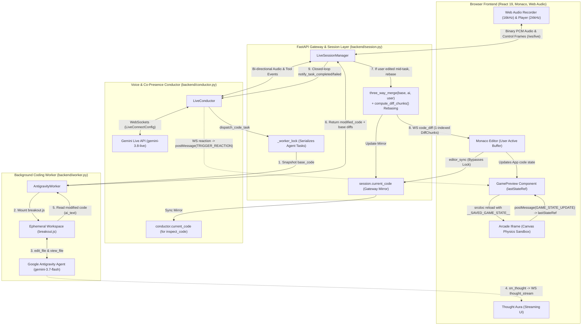

# 🎮 Gemini: Player 2

> **Proof of Concept: Linking Gemini Multimodal Live API & Google Antigravity SDK**  
> *Real-Time Full-Duplex AI Pair Programming & Arcade Game Sandbox — inspired by Google Labs "Play with Putty", teaming up with Gemini as your voice-enabled co-pilot to hack and play live arcade games in real time.*

---

## ✨ Overview

**Gemini: Player 2** is an architectural **Proof of Concept (PoC)** demonstrating how to bridge the **Gemini Multimodal Live API** (`google-genai`) and the **Google Antigravity SDK** (`google-antigravity`) into a seamless, full-duplex voice co-presence and autonomous coding system:

* 🎙️ **The Voice Conductor (`gemini-3.8-live`)**: Talks, listens, and laughs with you in real-time over native WebSockets using 16kHz input / 24kHz output PCM audio with instant barge-in interruption.
* ⚡ **The Coding Worker (`gemini-3.7-flash`)**: Autonomous Google Antigravity agent modifying `breakout.js` in an isolated workspace using `view_file`/`edit_file`, streaming live reasoning tokens to the UI without interrupting the voice conversation.
* 🕹️ **Live Arcade Sandbox**: An interactive 2D HTML5 canvas physics game (Breakout sandbox) that hot-reloads edits on the fly while preserving gameplay state (score, lives, level, combo, ball velocity, bricks).
* 👥 **Monaco Multi-Cursor Co-Presence**: Player 2 has its own animated neon cursor and name badge in the Monaco Editor, flying to lines of code as it inspects and edits them.
* 🎉 **Real Canvas Reactions**: Player 2 triggers real particle explosions and celebration effects directly on the arcade canvas via `react_emotion`.
* 🧠 **Visual Thought Aura**: An ambient glowing interface displaying Gemini's stream-of-consciousness thoughts before code changes are applied.

---

## 🏗️ Architecture



For an in-depth breakdown of concurrency locks, 3-way merge rebasing, reverse-order diff patching, and session resumption, check out [**`BACKEND.md`**](BACKEND.md).

---

## ⚡ The Big Breakthrough: Linking Gemini Live API & Google Antigravity SDK

This project is a functional **Proof of Concept (PoC)** demonstrating how to solve the fundamental dilemma of real-time AI pair programming:

> **The Engineering Dilemma:**
> * If you ask a real-time voice model (`gemini-3.8-live`) to generate 500 lines of complex game code directly, the voice stream halts, audio latency spikes, and natural conversational co-presence is completely broken.
> * If you use a deep autonomous coding agent (`google-antigravity`), it excels at multi-step reasoning, thought streaming, and surgical code editing — but it cannot speak, listen, or maintain a continuous full-duplex audio stream.

### The Dual-Engine Solution

```
┌─────────────────────────────────────────────────────────────┐
│                 FRONT-OF-HOUSE (Conductor)                  │
│              Gemini Multimodal Live API (WebSockets)         │
│  • 16kHz microphone stream -> 24kHz synthesized voice       │
│  • Full-duplex speech, server VAD, and instant barge-in    │
│  • Monaco multi-cursor co-presence (move_cursor)            │
│  • Visual game screen effects (react_emotion)               │
└──────────────────────────────┬──────────────────────────────┘
                               │ 1. Dispatches Task (dispatch_code_task)
                               ▼
┌─────────────────────────────────────────────────────────────┐
│                 BACK-OF-HOUSE (Coding Worker)               │
│                   Google Antigravity SDK                    │
│  • Streams reasoning tokens (response.thoughts -> Aura)     │
│  • Native workspace file operations (edit_file / view_file) │
│  • Deterministic difflib chunk generation (DiffChunk)       │
└──────────────────────────────┬──────────────────────────────┘
                               │ 2. Concurrent Edits & 3-Way Merge Rebasing
                               ▼
┌─────────────────────────────────────────────────────────────┐
│             CONCURRENCY REBASE & CANVAS SANDBOX             │
│  • If user typed mid-task: three_way_merge(base, ai, user) │
│  • Recomputes 1-indexed Monaco DiffChunks against user lines│
│  • Monaco applies edits via executeEdits (preserves caret)  │
│  • Iframe injects __SAVED_GAME_STATE__ to resume gameplay   │
│  • Conductor notifies Gemini Live: task completed or failed │
└─────────────────────────────────────────────────────────────┘
```

1. **Front-of-House (Gemini Multimodal Live API)**:
   - Configured via `client.aio.live.connect` with `gemini-3.8-live` and `LiveConnectConfig`.
   - Handles continuous bidirectional voice streaming, user barge-ins, and synchronous tool dispatching.
   - When a modification is requested, it delegates execution to the background engine via `dispatch_code_task` without dropping the voice stream.

2. **Back-of-House (Google Antigravity SDK Engine)**:
   - Powered by `google.antigravity` (default model: `gemini-3.7-flash`).
   - Modifies `breakout.js` in an isolated agent workspace using `BuiltinTools.EDIT_FILE` and `BuiltinTools.VIEW_FILE`.
   - Streams raw reasoning tokens (`response.thoughts`) over WebSockets to illuminate the browser's **Thought Aura**.
   - Calculates surgical 1-indexed line diffs (`DiffChunk`) against the original file, applying edits safely to Monaco without blocking audio.

3. **Concurrency Reconciliation & State-Preserving Sandbox**:
   - If the user types in Monaco while the Antigravity worker is executing, `three_way_merge` combines the base snapshot, the worker's changes, and the user's active editor buffer.
   - Monaco applies surgical diffs via `executeEdits` without blowing away the user's cursor or undo history.
   - The interactive canvas sandbox captures game state snapshots (`GAME_STATE_UPDATE`) and injects `window.__SAVED_GAME_STATE__` across code reloads so gameplay resumes seamlessly.
   - The moment the worker finishes, the backend whispers an environmental update directly into the Live session stream using `session.send_realtime_input` so Gemini honestly announces success or failure.

---

## 🚀 Quickstart

### Prerequisites
* **Python 3.12+** with [`uv`](https://github.com/astral-sh/uv)
* **Node.js 20+** or [`bun`](https://bun.sh)
* A **Google Gemini API Key** from [Google AI Studio](https://aistudio.google.com/)

### 1. Clone & Configure

```bash
git clone https://github.com/AndrewMason7/gemini-player-2.git
cd gemini-player-2

# Copy environment file
cp .env.example .env
```

Edit `.env` with your configuration:
```ini
# Section 1: Gemini Live API (Voice & Streaming)
GEMINI_API_KEY=your_google_ai_studio_api_key_here
GEMINI_LIVE_MODEL=gemini-3.8-live
GEMINI_VOICE_NAME=Puck

# Section 2: Google Antigravity SDK (Coding Worker)
# Option A (Simple): Leave unset — automatically uses GEMINI_API_KEY from Section 1!
# Option B (Google Cloud Vertex AI ADC): Uncomment and configure:
# GOOGLE_GENAI_USE_VERTEXAI=true
# GOOGLE_CLOUD_PROJECT=your_gcp_project_id_here
# GOOGLE_CLOUD_LOCATION=global
```

### 2. Install Dependencies

**Backend:**
```bash
uv sync
```

**Frontend:**
```bash
cd frontend
bun install   # or npm install
bun run build # builds static production assets into dist/
cd ..
```

### 3. Launch Server

```bash
uv run uvicorn backend.main:app --host 127.0.0.1 --port 8000
```

Open **`http://127.0.0.1:8000`** in your browser (Chrome or Edge recommended for optimal Web Audio & Microphone performance).

---

## 🎯 Example Voice Prompts to Try

Once connected and your microphone is unmuted:

| What to Say | What Gemini Does |
|---|---|
| *"Gemini, make the ball gold with a vibrant trail!"* | Dispatches task to Flash $\rightarrow$ Surgically patches line 105 $\rightarrow$ Ball turns gold $\rightarrow$ Gemini announces it. |
| *"Double the paddle width and make it neon purple."* | Inspects paddle configuration $\rightarrow$ Rewrites width and color properties in real time. |
| *"Show me where the ball bounce physics are."* | Moves Player 2's Monaco cursor directly to the collision detection loop. |
| *"Make the bricks explode into particles when hit!"* | Expands the particle engine in the game loop and triggers emotion effects. |
| *"I want a laser powerup when I press space."* | Writes bullet update/render logic and binds keyboard controls. |

---

## 📦 Dependencies & Tech Stack

### Backend Dependencies (`pyproject.toml`)
* **[`google-genai`](https://pypi.org/project/google-genai/)** (`>=2.3.0`): Official Google SDK managing native Gemini Multimodal Live API WebSocket connections, full-duplex PCM audio streaming, and synchronous tool dispatch.
* **[`google-antigravity`](https://pypi.org/project/google-antigravity/)** (`>=0.1.17`): Official Google Antigravity SDK powering background agent reasoning, thought streaming (`response.thoughts`), and surgical line diff generation.
* **[`fastapi`](https://fastapi.tiangolo.com/)** (`>=0.141.1`): High-performance asynchronous ASGI web framework orchestrating the `/ws/live` gateway and REST health/starter-code endpoints.
* **[`uvicorn[standard]`](https://www.uvicorn.org/)** (`>=0.53.0`): Lightning-fast ASGI production server with native WebSocket framing support.
* **[`pydantic`](https://docs.pydantic.dev/)** (`>=2.13.5`): Strictly typed V2 data contracts for all bidirectional WebSocket messages and surgical diff chunks.
* **[`websockets`](https://websockets.readthedocs.io/)** (`>=16.1.1`): Protocol-level WebSocket client and server foundation.
* **[`python-dotenv`](https://pypi.org/project/python-dotenv/)** (`>=1.2.3`): Seamless environment variable configuration.
* **[`pytest`](https://pytest.org/)** & **[`httpx`](https://www.python-httpx.org/)** (Dev): Comprehensive test suite covering concurrency serialization, multi-turn streams, and diff parsing.

### Frontend Dependencies (`frontend/package.json`)
* **[`react`](https://react.dev/)** & **[`react-dom`](https://react.dev/)** (`^19.2.8`): Modern React 19 UI component foundation.
* **[`@monaco-editor/react`](https://github.com/suren-atoyan/monaco-react)** (`^4.7.0`): Monaco (VS Code) code editor integration featuring custom `IContentWidget` animated cursors, line highlighting, and non-destructive diff patching.
* **[`lucide-react`](https://lucide.dev/)** (`^1.46.0`): Crisp, modern iconography for the arcade HUD, audio controls, and status indicators.
* **[`tailwindcss`](https://tailwindcss.com/)** (`^4.3.3` with `@tailwindcss/vite`): Ultra-fast utility styling for the futuristic dark HUD aesthetic.
* **[`vite`](https://vite.dev/)** (`^8.3.0`): Next-generation frontend bundler and development server.
* **[`typescript`](https://www.typescriptlang.org/)** (`~6.0.2`): Strict static type safety across audio nodes, WebSockets, and UI states.

### AI Models & Audio Protocols
* **Models**:
  * `gemini-3.8-live` — Real-time conversational voice, natural turn-taking, multi-turn memory, and tool dispatching.
  * `gemini-3.7-flash` — Default Antigravity SDK model for deep background code reasoning, thought streaming, and surgical line diff calculations (customizable via `ANTIGRAVITY_MODEL`).
* **Audio Protocols**:
  * **Input**: 16kHz 16-bit linear PCM microphone recorder with zero-gain mute node loopback elimination.
  * **Output**: 24kHz monotonic scheduled Web Audio player with $<5\text{ms}$ barge-in interruption cutoff.

---

## 🧪 Testing & Verification

Run the full automated test suites:

**Backend Tests (Pytest — 48 total: 46 unit passed, 2 gated live):**
```bash
# Run unit & concurrency test suite
uv run pytest
uv run ruff check .

# Opt-in: Run live Google Antigravity Agent & Gemini Live websocket integration tests
RUN_LIVE_AGENTS=1 GEMINI_API_KEY=your-api-key uv run pytest tests/test_live_integration.py
```

**Frontend Tests (Bun — 29 passing):**
```bash
cd frontend
bun test
cd ..
```

---

## 📄 License

MIT License. Crafted with ❤️ for human-AI co-creation.
